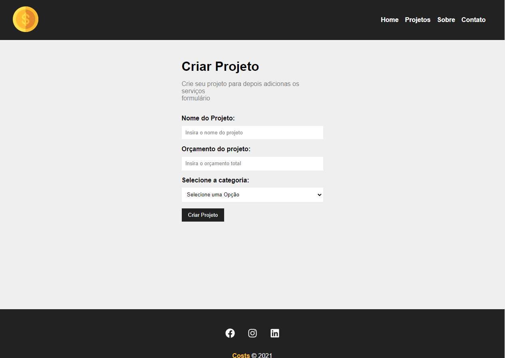
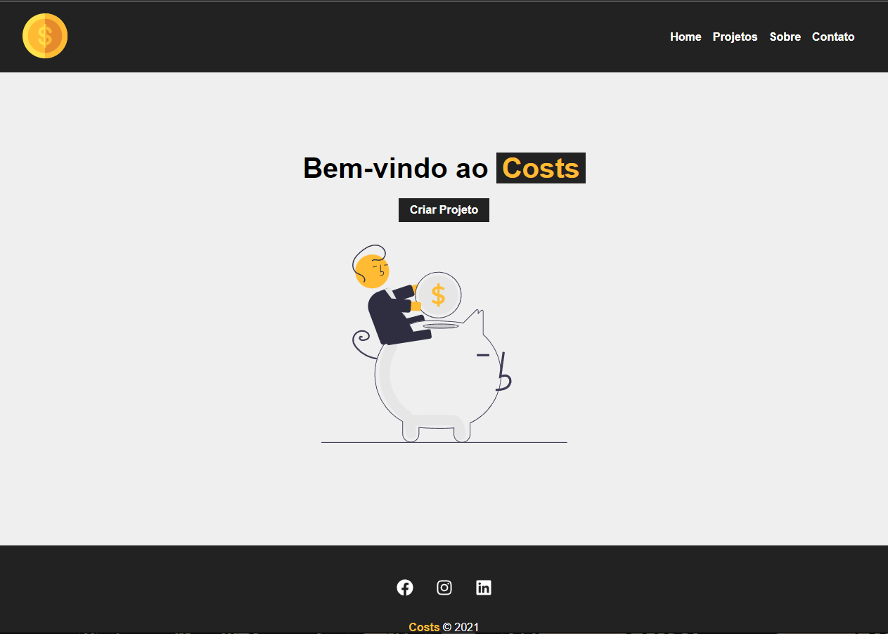

# Costs


 


> WepApp criado seguindo o curso do Matheus Battisti, sobre React e React Router DOM, onde o usuário insere em um falso backend, por requisição como uma API, um projeto, quanto vai ser o custo, e a categoria do projeto

### funcionalidades

O projeto se encontra concluido, porem com necessidades de refatoração:

- [x] CRUD de projetos
- [x] Recuperação dos projetos do arquivo ( falso backend ) via fetch
- [x] Categorias de projetos ja inseridas no arquivo de backend, sendo recuperados via fetch
- [x] paginação com React Router DOM
- [x] Utilização de React Hooks como useEffect e useState
      


## 💻 Pré-requisitos

Antes de começar, verifique se você atendeu aos seguintes requisitos:

- Node instalado na máquina
- NPM instalado na máquina

## 🚀 Instalando o Costs

Para instalar o Costs, siga estas etapas:

clone o projeto na sua máquina
```
git clone https://github.com/bielViccari/costs-React-App.git
```

vá até a pasta clonada
```
cd costs-React-App
```

acesse a pasta costs
```
cd costs
```

execute o npm install para instalar as dependências do composer.json
```
npm install
```


## ☕ Usando o Costs

Para usar o Costs, siga estas etapas:


Execute o comando npm start para iniciar a aplicação
```
npm start
```

Execute o comando npm run backend para iniciar o backend e colocar o arquivo bd em um endereço local para ser utilizado como uma API
```
npm run backend
```

## 🤝 Colaboradores

Agradecemos às seguintes pessoas que contribuíram para este projeto:

<table>
  <tr>
    <td align="center">
      <a href="#" title="defina o titulo do link">
        <br>
        <sub>
          <b>Gabriel Viccari</b>
        </sub>
      </a>
    </td>
  </tr>
</table>
